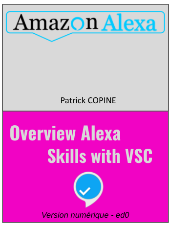

# Build Skills with VSC
Le livre **Build Skills with VSC** de la série des livres de découverte de la réalisation de Skills Alexa n'a pas d'exemples de code relatifs à la configuration du front-end ou aux sources de la partie back-end sous Nodejs.

Il s'appuie essentiellement sur la skill HelloWorld disponible sous Git. Plusieurs variantes sont possibles pour minimiser le transfert de sources à builder sur AWS Lambda dans le cas de skills qui ne sont pas hébergées par le service Alexa. Le code à base de 2 scripts bash est donné en exemple pour l'une de ces variantes, ainsi que la configuration de Visual Studio Code pour les utiliser depuis l'IDE.

Le fichier *launch.json* du répertoire **bash** est à actualiser en fonction du contexte local du poste de travail. 
