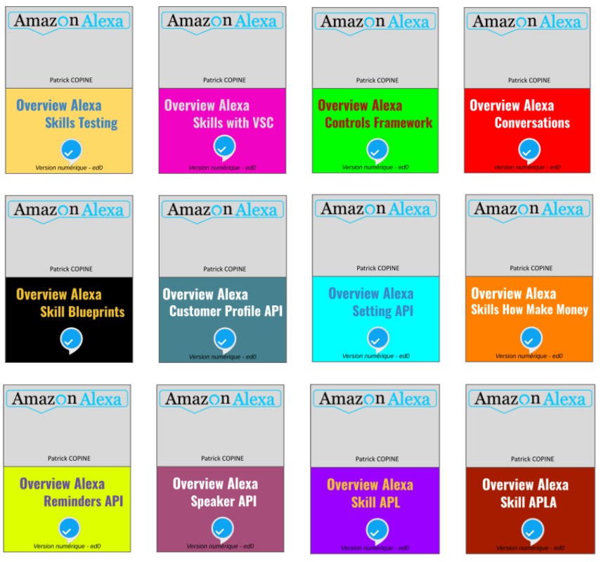

# Overview_Alexa_Skills
Dans le cadre de la rédaction d'une série de livres de découverte sur l'univers de développement de skills Alexa, des sources donnés en exemple ou en cas d'usage sont associés à chacun d'entre-eux. Ce référentiel les regroupe par livre produit. La série de livres sur la découverte des skills Alexa sera réalisée progressivement, car l'écriture documentaire prend beaucoup plus de temps que la réalisation de code. 

Le premier ouvrage de la série ci-dessous concerne la prise en main de l'IDE Visual Studio Code dans le cadre du développement d'une skill. 

